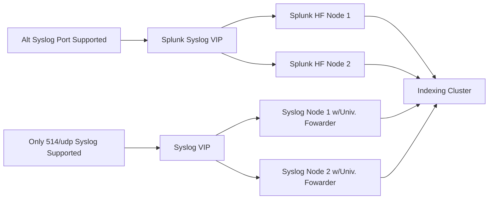

# Suggested Syslog Build for Splunk

## Syslog Build Guide

I have broken out the Build and Configuration Guides into separate documents because many people are finally making the transition to an automated build process. 

The [Server Build Guide](Syslog/syslog-server-build.MD) contains a step-by-step guide to get a basic server built and ready to go with rsyslog.

The [Server Configuration Guide](Syslog/syslog-server-configure.MD) contains a step-by-step guide to setup rsyslog in a way that is IMO easily maintained across multiple nodes.

